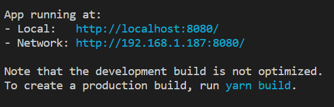
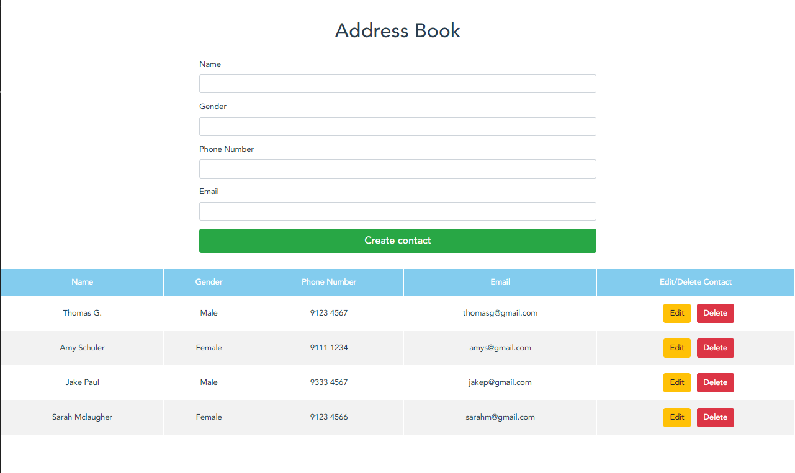

# CS3219 Task B4: Frontend SPA using Vue

## Jack Chen Yu Jie

## TOC

1. [Link to Task B1 to B3](https://github.com/Jackimaru96/CS3219_TaskB1-B3)
2. [Task B4](#Task-B4)

## Task B4

### Build a frontend SPA using Vue or any other framework

#### Objective:

1. Demonstrate ability to interact with the API using the frontend (2 marks)
2. Implementation of style e.g. using Bootstrap (1 mark)

### Setup

#### Requirements: [yarn](https://classic.yarnpkg.com/en/docs/install/#windows-stable), [NodeJS](https://nodejs.org/en/download/)

1. Fork and clone this repo to your local machine
2. Execute `yarn install` in project root directory to install dependencies
3. Execute `yarn serve` to run the web app on your local machine and you will see this in your terminal
   
4. Using your favourite web browser, go to http://localhost:8080/
5. You can also visit this [link](fill-in.com) to access the web app that is deployed on Heroku

## Screenshots

